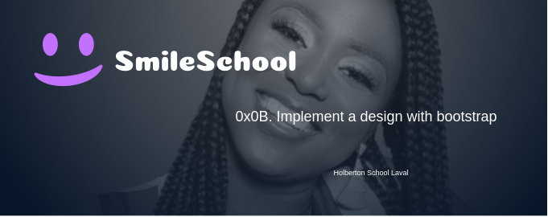
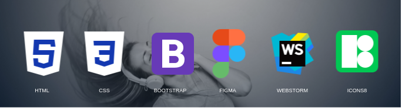

    

# The concept

In this project, we will implement 3 web pages with Bootstrap. We will use all 
HTML/CSS/Accessibility/Responsive design/Bootstrap knowledges that we learned previously.

We won’t have a lot of instruction, we are free to implement it the way that we want - the 
objective is simple: Have fully functional web pages that look the same as the designer file.

# The final result

    

# Tools

    

Icons by <a target="_blank" href="https://icons8.com">Icons8</a>

# Contact me

    

